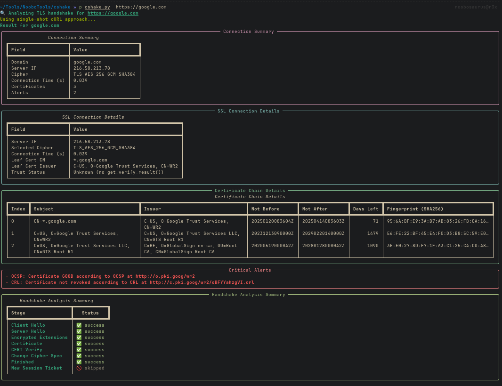
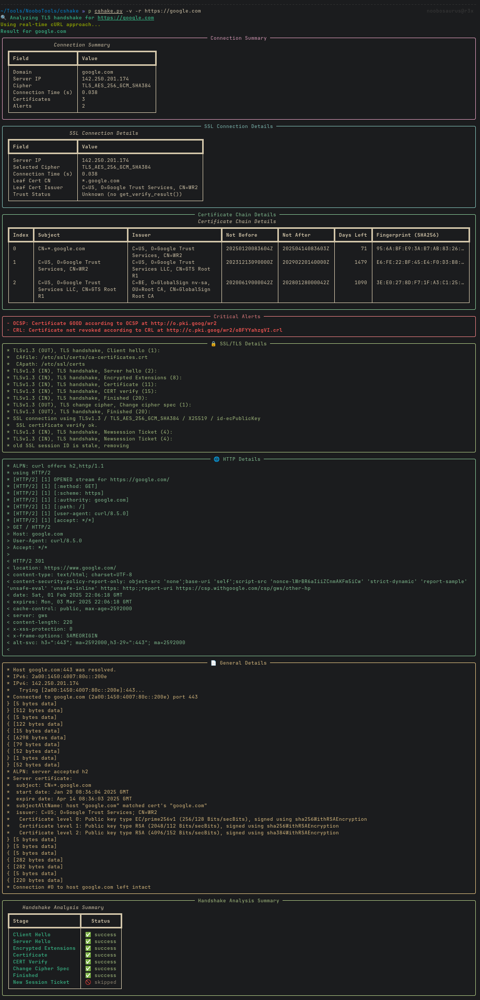
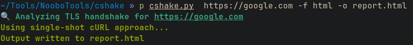
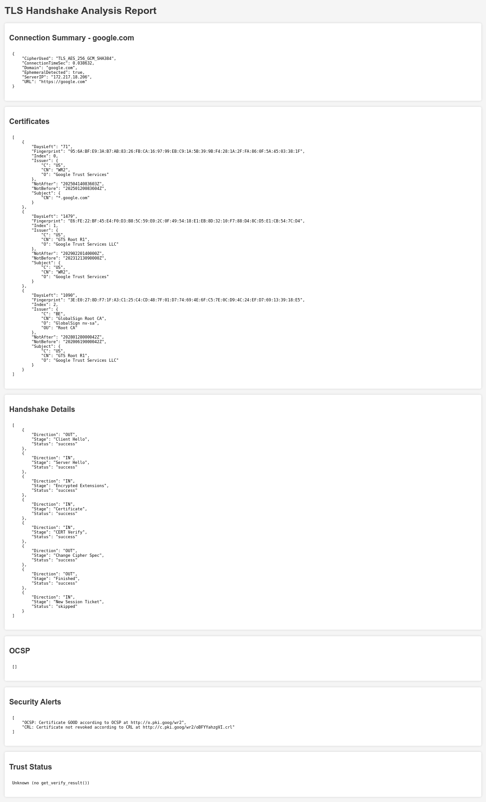
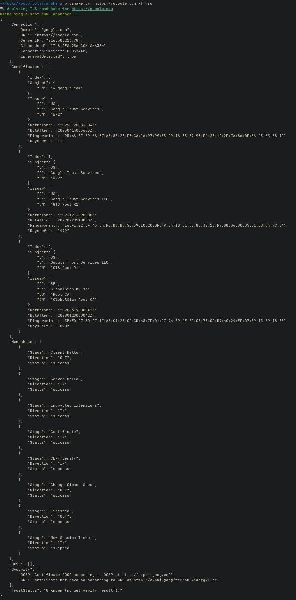

# cshake

**A minimal yet practical command-line tool for advanced TLS handshake analysis.**
cshake performs in-depth certificate inspection, dual revocation checks (OCSP and CRL), ephemeral key detection, and real-time or single-shot TLS stage logging via cURL. It also exposes machine-readable JSON/YAML/HTML outputs for automation or integration.

> **Note:** This tool is designed to be lightweight and practical—it does not replace more comprehensive scanners (e.g., sslyze) but offers a unique, interactive view of TLS handshakes.

---

## Table of Contents

1. [Features](#features)
2. [Use Cases](#use-cases)
3. [Quick Start](#quick-start)
4. [Installation](#installation)
5. [Usage](#usage)
6. [Examples](#examples)
7. [Limitations](#limitations)
8. [License](#license)

---

## Features

- **TLS Handshake Analysis**
  - Single-shot or real-time cURL handshake analysis (e.g., Client Hello, Server Hello, etc.).
  - PyOpenSSL-based retrieval of the certificate chain, including leaf, intermediates, and the selected cipher.

- **Security Checks**
  - Detection of weak ciphers (RC4, DES, MD5, etc.).
  - Hostname validation (checks against CN and SAN).
  - Certificate expiration warnings (especially if within 30 days).
  - Dual revocation checks: Basic OCSP verification **and** CRL queries.

- **Ephemeral Key Detection**
  - Identifies modern key exchange protocols such as ECDHE, DHE, X25519, and others.

- **Output Flexibility**
  - Rich, interactive console output with tables and animations (powered by Rich).
  - Structured output in JSON, YAML, or HTML for CI pipelines or integration.

- **ASCII Visualization**
  - Optional step-by-step ASCII animation of the handshake stages (when not in real-time mode).

---

## Use Cases

cshake supports various professional use cases:

- **Cybersecurity & Penetration Testing:**
  Validates TLS configurations, detects weak ciphers, identifies expired certificates, and analyzes certificate chains to reveal misconfigurations or vulnerabilities.

- **IT Operations & System Administration:**
  Audits TLS settings on critical services, verifies certificate status, and ensures secure communication configurations across infrastructure.

- **OSINT & Incident Response:**
  Collects and analyzes TLS handshake data to aid investigations, validates digital certificates, and tracks anomalies within certificate chains.

- **Compliance & Certificate Management:**
  Monitors certificate expirations and revocation statuses (via OCSP and CRL) to maintain adherence to security standards and manage the certificate lifecycle.

- **Education & Research:**
  Visualizes TLS handshakes, certificate validations, and security checks, offering structured outputs for training sessions and academic studies.

---

## Quick Start

1.**Clone the Repository**

```bash
git clone https://github.com/noobosaurus-r3x/cshake.git
cd cshake
```

2.**Install Dependencies**

```bash
pip install -r requirements.txt
```

3.**Run the Script**

```bash
python3 cshake.py https://example.com
```

---

## Installation

- **Python 3.8+** is recommended.
- Basic dependencies include: `validators`, `rich`, `pyOpenSSL`, `cryptography`, and `requests`.
- For YAML output, install `PyYAML`; for HTML output, install `Jinja2`.

> **Note:** Ensure you have the necessary development libraries for OpenSSL installed if the compilation of `cryptography` is required.

---

## Usage

```bash
python3 cshake.py [OPTIONS] https://your-https-site.com
```

### Required Argument

- **`url`** (positional): Must be an HTTPS URL (e.g., `https://example.com`).

### Key Options

- **`-r`, `--realtime`**
  Enable real-time TLS handshake tracking via cURL output parsing.
  
- **`-v`, `--verbose`**  
  Display categorized cURL logs (e.g., SSL/TLS details, HTTP details, errors).
  
- **`-a`, `--ascii`**  
  Show an ASCII animation of the final handshake stages (skipped if using `--realtime`).
  
- **`--tlsv {1.2,1.3}`**  
  Force a specific TLS version in the PyOpenSSL handshake.
  
- **`-o, --output-format {json,yaml,html}`**  
  Output the results as JSON, YAML, or HTML. This also suppresses the interactive console output.
  
- **`--minimal`**  
  Display a condensed summary output.
  
- **`-h`, `--help`**  
  Show usage help.

---

## Examples

1.**Basic Single-Shot Analysis**

```bash
python3 cshake.py https://example.com
```

Displays handshake details, certificate chain, and security alerts.



2.**Real-Time Handshake Tracking with Verbose Output**

```bash
python3 cshake.py -r -v https://example.com
```

Tracks each TLS stage in real-time and displays detailed cURL logs.



3.**ASCII Animation**

```bash
python3 cshake.py https://example.com --ascii
```

Animates the handshake stages (if not in real-time mode).

4.**Structured Output**

- **HTML Output:**

```bash
python3 cshake.py -r -v https://example.com -o html > report.html
```





- **YAML Output:**

```bash
python3 cshake.py -r -v https://example.com -o yaml > report.yaml
```

- **JSON Output:**

```bash
python3 cshake.py -r -v https://example.com -o json > report.json
```



5.**Bulk Scanning**

Create a file (e.g., `urls.txt`) with one HTTPS URL per line, then run:

```bash
python3 cshake.py --input-file urls.txt
```

---

## Limitations

- **Chain Trust Verification:**  
  The tool does not use `get_verify_result()` for full certificate chain verification; trust status is reported as "Unknown."
  
- **OCSP/CRL Checks:**  
  OCSP queries are basic and may return partial results if the responder does not comply fully. CRL queries are performed only when distribution points are provided.
  
- **IPv6 Support:**  
  Current DNS resolution is primarily IPv4-based.
  
- **Parallel Processing:**  
  The tool targets one URL at a time. For bulk scanning, consider extending the code for asynchronous or parallel processing.

---

## License

Distributed under the MIT License. See `LICENSE` for more details.

---