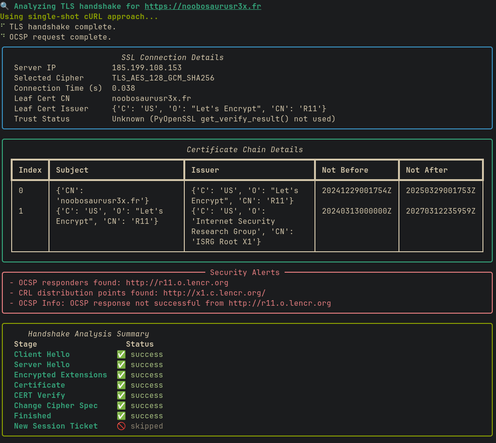
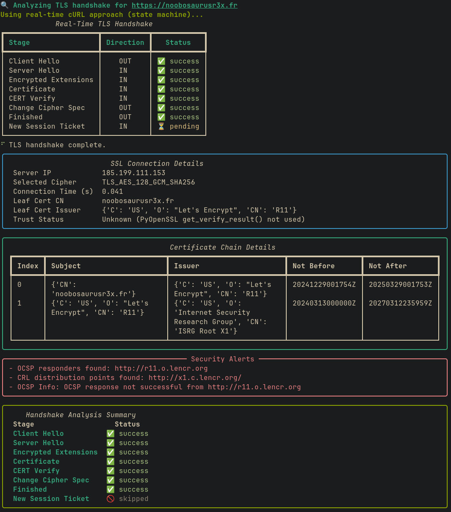
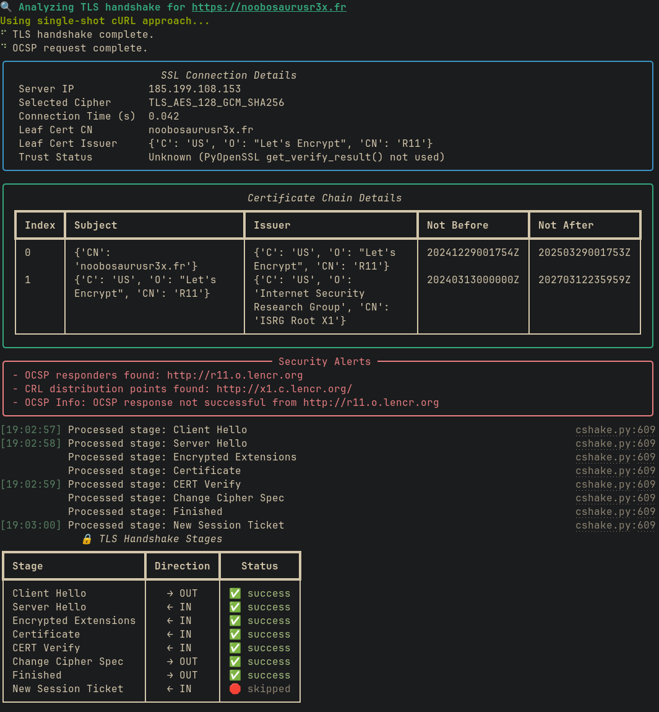
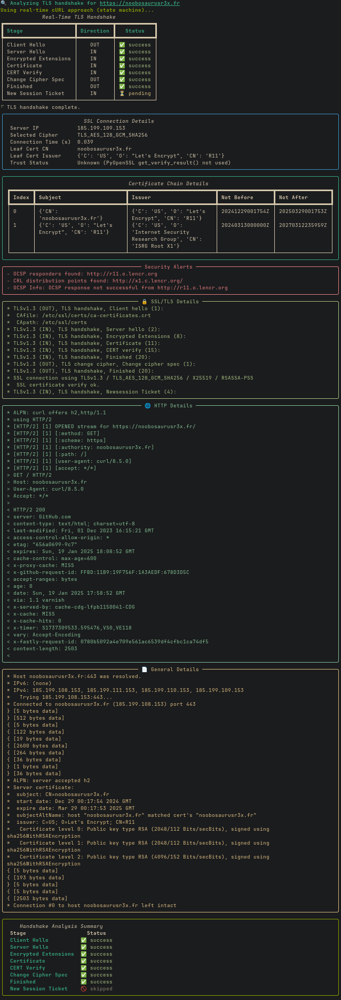

# cshake

**A minimal yet practical command-line tool for advanced TLS handshake analysis.**  
Performs in-depth certificate inspection, basic OCSP revocation checks, ephemeral key detection, and real-time or single-shot TLS stage logging via cURL. Exposes machine-readable JSON/YAML outputs for automation or integration.

---

## Table of Contents

1. [Features](#features)
2. [Installation](#installation)
    - [Using Python](#using-python)
    - [Using Docker](#using-docker)
3. [Usage](#usage)
    - [Python Usage](#python-usage)
    - [Docker Usage](#docker-usage)
4. [Examples](#examples)
    - [Python Examples](#python-examples)
    - [Docker Examples](#docker-examples)
5. [Limitations](#limitations)
6. [License](#license)

---

## Features

- **TLS Handshake**
  - Single-shot or real-time cURL handshake analysis (Client Hello, Server Hello, etc.).
  - PyOpenSSL-based chain retrieval (showing leaf, intermediates, selected cipher).

- **Security Checks**
  - Weak cipher detection (RC4, DES, etc.).
  - Hostname validation (CN and SAN checks).
  - Certificate expiration warnings (<30 days).
  - Basic OCSP verification for revocation checks.

- **Ephemeral Key Detection**
  - Identifies TLS 1.3 or ciphers like ECDHE, DHE, X25519, etc.

- **Output Flexibility**
  - Rich console tables and progress animations by default.
  - JSON or YAML output modes for scripting and CI pipelines.

- **ASCII Visualization**
  - Optional ASCII animation (`-a`) to display final TLS handshake stages if not in real-time mode.

---

## Installation

### Using Python

1. **Clone the Repository**

    ```bash
    git clone https://github.com/noobosaurus-r3x/cshake.git
    cd cshake
    ```

2. **Install Dependencies**

    ```bash
    pip install -r requirements.txt
    ```

3. **Run the Script**

    ```bash
    python3 cshake.py https://example.com
    ```

- **Requirements:**
  - **Python 3.8+** recommended.
  - Dependencies: `validators`, `rich`, `pyOpenSSL`, `cryptography`, and `requests`.
  - *(Optional)* `pyyaml` for YAML output (`-o yaml`).

- **Note:** Ensure you have the necessary development libraries for OpenSSL installed on your system if compilation of `cryptography` is needed.

### Using Docker

Docker allows you to run `cshake` without managing dependencies manually.

1. **Install Docker**

    - [Download and install Docker](https://www.docker.com/get-started) for your operating system.

2. **Pull the Docker Image**

    ```bash
    docker pull noobosaurusr3x/cshake:latest
    ```


---

## Usage

### Python Usage

```bash
python3 cshake.py [OPTIONS] https://your-https-site.com
```

**Required Argument**

- `url` (positional): Must be an HTTPS URL (e.g., `https://example.com`).

**Key Options**

- `-r`, `--realtime`  
  Shows TLS stages in real time via cURL output parsing.

- `-v`, `--verbose`  
  Displays categorized cURL output (SSL, HTTP, errors, etc.).

- `-a`, `--ascii`  
  Animates the final handshake stages in ASCII (skipped if `--realtime` is used).

- `--tlsv {1.2,1.3}`  
  Forces a specific TLS version in the PyOpenSSL handshake.

- `-o, --output-format {json,yaml}`  
  Prints results as JSON or YAML and skips Rich console output.

- `-h`, `--help`  
  Shows usage help.

### Docker Usage

```bash
docker run --rm -it -e TERM=xterm-256color noobosaurusr3x/cshake [OPTIONS] https://your-https-site.com
```

**Required Argument**

- `url` (positional): Must be an HTTPS URL (e.g., `https://example.com`).

**Key Options**

- `-r`, `--realtime`  
  Shows TLS stages in real time via cURL output parsing.

- `-v`, `--verbose`  
  Displays categorized cURL output (SSL, HTTP, errors, etc.).

- `-a`, `--ascii`  
  Animates the final handshake stages in ASCII (skipped if `--realtime` is used).

- `--tlsv {1.2,1.3}`  
  Forces a specific TLS version in the PyOpenSSL handshake.

- `-o, --output-format {json,yaml}`  
  Prints results as JSON or YAML and skips Rich console output.

- `-h`, `--help`  
  Shows usage help.

> **Important:** To enable colored output within Docker, set the `TERM` environment variable to `xterm-256color` using the `-e` flag as shown above.

---

## Examples

### Python Examples

1. **Basic Single-Shot Analysis**

    ```bash
    python3 cshake.py https://noobosaurusr3x.fr
    ```

    Displays handshake details, certificate chain, and basic security alerts.


2. **Real-Time Handshake Tracking**

    ```bash
    python3 cshake.py https://noobosaurusr3x.fr -r
    ```

    Outputs each TLS stage (Client Hello, Server Hello, etc.) in real-time.


3. **Verbose Output**

    ```bash
    python3 cshake.py https://example.com -v
    ```

    Shows categorized cURL logs (SSL/TLS lines, HTTP lines, errors, etc.).

4. **ASCII Animation**

    ```bash
    python3 cshake.py https://noobosaurusr3x.fr -a
    ```

    Provides a step-by-step console animation of the handshake stages (if not using `--realtime`).

5. **Structured Output**

    ```bash
    python3 cshake.py https://example.com -o json
    ```

    Prints the final results in JSON. Use `-o yaml` for YAML.

6. **Combined Real-Time and Verbose Output**

    ```bash
    python3 cshake.py https://noobosaurusr3x.fr -r -v
    ```

    Combines real-time TLS stage tracking with verbose cURL output.


    > **Note:** The `-a` (ASCII Animation) and `-r` (Real-Time) options are **incompatible** and cannot be used together. If both flags are provided, `-r` will take precedence, and `-a` will be ignored.

### Docker Examples

1. **Basic Single-Shot Analysis**

    ```bash
    docker run --rm -it -e TERM=xterm-256color noobosaurusr3x/cshake https://example.com
    ```

    Displays handshake details, certificate chain, and basic security alerts.

2. **Real-Time Handshake Tracking**

    ```bash
    docker run --rm -it -e TERM=xterm-256color noobosaurusr3x/cshake https://example.com -r
    ```

    Outputs each TLS stage (Client Hello, Server Hello, etc.) in real-time.

3. **Verbose Output**

    ```bash
    docker run --rm -it -e TERM=xterm-256color noobosaurusr3x/cshake https://example.com -v
    ```

    Shows categorized cURL logs (SSL/TLS lines, HTTP lines, errors, etc.).

4. **ASCII Animation**

    ```bash
    docker run --rm -it -e TERM=xterm-256color noobosaurusr3x/cshake https://example.com -a
    ```

    Provides a step-by-step console animation of the handshake stages (if not using `--realtime`).

5. **Structured Output**

    ```bash
    docker run --rm -it -e TERM=xterm-256color noobosaurusr3x/cshake https://example.com -o json > result.json
    ```

    Prints the final results in JSON and saves it to `result.json`. Use `-o yaml` for YAML.

6. **Combined Real-Time and Verbose Output with Colors**

    ```bash
    sudo docker run -it --rm -e TERM=xterm-256color noobosaurusr3x/cshake https://google.com -v -r
    ```

    Combines real-time TLS stage tracking with verbose cURL output and enables colored output by setting the `TERM` environment variable.

    > **Note:** Colors appear only when the `TERM` environment variable is set to `xterm-256color`. Ensure you include `-e TERM=xterm-256color` in your Docker run command to enable colored output.

---

## Limitations

- **Chain Trust**  
  PyOpenSSL’s `get_verify_result()` is intentionally not used, so trust validation remains “Unknown.”

- **OCSP Checks**  
  Only a single-responder query. Some CAs may not respond cleanly, though the script will show partial results.

- **No Multi-Domain Parallelism**  
  Currently targets one URL at a time. Extend or fork the code for batch analysis.

---

## License

This project is licensed under the [MIT License](LICENSE).

---


---
